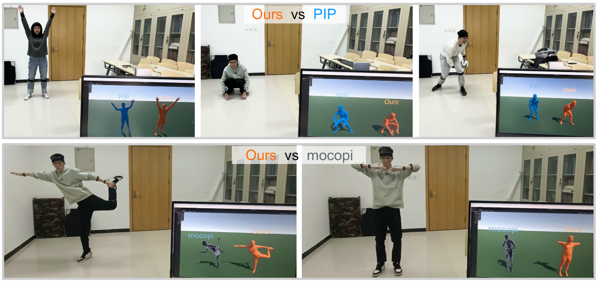

# PNP

Code for our SIGGRAPH 2024 [paper]() "Physical Non-inertial Poser (PNP): Modeling Non-inertial Effects in Sparse-inertial Human Motion Capture". See [Project Page](https://xinyu-yi.github.io/PNP/).



## Usage

### Install dependencies

We use `python 3.8.10`. You should install `chumpy open3d pybullet qpsolvers numpy-quaternion vctoolkit==0.1.5.39` and `pytorch` with CUDA (we use pytorch 2.0.1 with CUDA 11.8). You also need to compile and install [rbdl 2.6.0](https://github.com/rbdl/rbdl) with python bindings and urdf reader addon.

*If `chumpy` reports errors, comment the lines `from numpy import bool ...` that generate errors.*

*If `quadprog` solver is not found, install with `pip install qpsolvers[quadprog]`*

*If you have configured [PIP](https://github.com/Xinyu-Yi/PIP/), just use its environment and install missing dependencies.*

### Prepare SMPL body model

1. Download SMPL model from [here](https://smpl.is.tue.mpg.de/). You should click `SMPL for Python` and download the `version 1.0.0 for Python 2.7 (10 shape PCs)`. Then unzip it.
2. Rename and put the male model file into `models/SMPL_male.pkl`.

### Prepare physics body model

1. Download the physics body model from [here](https://xinyu-yi.github.io/PIP/files/urdfmodels.zip) and unzip it.
2. Rename and put the files into `models/physics.urdf`, `models/plane.obj`, `models/plane.urdf`.

*The physics model and the ground plane are modified from [physcap](https://github.com/soshishimada/PhysCap_demo_release).*

### Prepare pre-trained network weights

1. Download weights from [here]().
2. Rename and put the file into `data/weights/PNP/weights.pt`.

### Prepare test datasets

1. Download the preprocessed DIP-IMU and TotalCapture dataset (with two different calibrations as listed in the paper) from [here](). Please note that by downloading the preprocessed datasets you agree to the same license conditions as for the DIP-IMU dataset (https://dip.is.tue.mpg.de/) and the TotalCapture dataset (https://cvssp.org/data/totalcapture/). You may only use the data for scientific purposes and cite the corresponding papers.
2. Rename and put the files into `data/test_datasets/dipimu.pt`, `data/test_datasets/totalcapture_dipcalib.pt`, `data/test_datasets/totalcapture_officalib.pt`.

*We provided a `process.py` script, which was used to generate the preprocessed values from the raw datasets (not cleaned, may need some modifications).*

### Run the evaluation

```
python test.py
```

The pose/translation evaluation results for DIP-IMU and TotalCapture (DIP/Official Calibration) will be printed/drawn.


## TODO
- [ ] Live Demo
- [ ] IMU synthesis


## Citation

If you find the project helpful, please consider citing us:

```
@inproceedings{yi2024pnp,
  title={Physical Non-inertial Poser (PNP): Modeling Non-inertial Effects in Sparse-inertial Human Motion Capture},
  author={Yi, Xinyu and Zhou, Yuxiao and Xu, Feng},
  booktitle={SIGGRAPH 2024 Conference Papers},
  year={2024}
}
```

